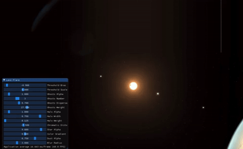

# Lens Flare

An OpenGL lens flare effect. Tested on Mac OSX.

To get started:

* `git submodule update --init --recursive`
* `mkdir Build && cd Build`
* `ccmake -G Xcode ..`
  * press `c` to configure, `e` to exit config, `g` to generate Xcode project
* `open LensFlare.xcodeproj`

Right-click and drag to pan the image.

Lens flare technique from [John Chapman](http://john-chapman-graphics.blogspot.com/2013/02/pseudo-lens-flare.html).

Boilerplate from [Glitter](http://polytonic.github.io/Glitter/) a dead simple boilerplate for OpenGL.
